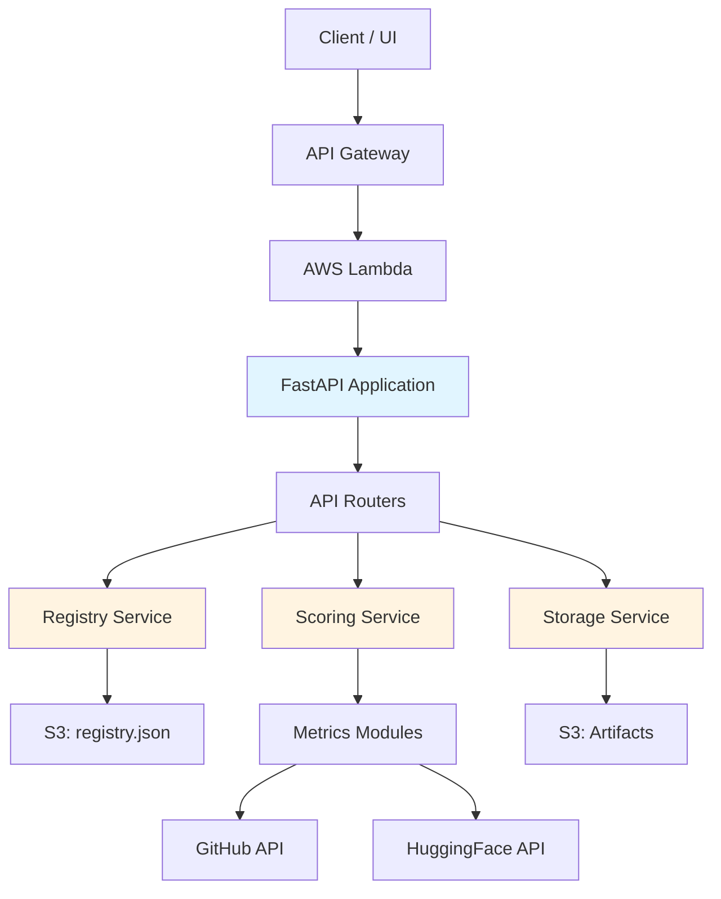
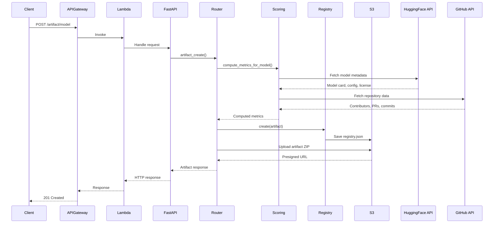

## Overview

The Trustworthy Model Registry is built as a cloud-native, serverless application designed to run on AWS while maintaining compatibility with local development environments. The system follows a modular architecture with clear separation of concerns across API routing, business logic, data persistence, and metric computation.

## High-level architecture



## AWS components

The system is deployed entirely on AWS using free-tier-compatible services:

<CardGroup cols={2}>
  <Card title="AWS Lambda" icon="bolt">
    Stateless execution of the FastAPI backend via the Mangum adapter. Handles all API requests without maintaining server state.
  </Card>
  <Card title="API Gateway" icon="route">
    Public REST interface that routes HTTP requests to Lambda. Provides CORS handling and request/response transformation.
  </Card>
  <Card title="Amazon S3" icon="database">
    Persistent storage for both the registry metadata (registry.json) and artifact binaries (models, datasets, code).
  </Card>
  <Card title="CloudWatch" icon="chart-line">
    Centralized logging and monitoring. All requests, errors, and metrics are captured for observability.
  </Card>
</CardGroup>

<Info>
All AWS services are configured to stay within free-tier limits, making the system cost-effective for development and demonstration purposes.
</Info>

## Application structure

The codebase is organized into several key modules:

### API layer (`src/api/`)

Handles HTTP routing, request validation, and response formatting.

<Accordion title="src/main.py - Application entry point">
Initializes the FastAPI application and configures middleware:

```python src/main.py
from fastapi import FastAPI
from starlette.middleware.cors import CORSMiddleware
from mangum import Mangum

from src.api.routers.models import router as models_router
from src.api.middleware.log_requests import DeepASGILogger

# Create FastAPI app
app = FastAPI(title="SOTeam4P2 API")

# Add logging middleware
app.add_middleware(DeepASGILogger)

# Configure CORS
app.add_middleware(
    CORSMiddleware,
    allow_origins=["http://sot4-model-registry-dev.s3-website.us-east-2.amazonaws.com"],
    allow_credentials=False,
    allow_methods=["*"],
    allow_headers=["*"],
)

# Mount API routers
app.include_router(models_router, prefix="/api")

# AWS Lambda handler
handler = Mangum(app)
```

Key decisions:
- Middleware is added **before** routers to guarantee full request coverage
- CORS is handled at the application level for consistency
- Mangum adapter enables seamless Lambda deployment without code changes
</Accordion>

<Accordion title="src/api/routers/models.py - API endpoints">
Implements all registry endpoints following the OpenAPI specification:

**Core endpoints:**
- `POST /artifact/{type}` - Create new artifacts
- `GET /artifacts/{type}/{id}` - Retrieve artifact by ID
- `PUT /artifacts/{type}/{id}` - Update artifact metadata
- `DELETE /artifacts/{type}/{id}` - Delete an artifact
- `POST /artifacts` - List/enumerate artifacts with pagination

**Model-specific endpoints:**
- `GET /artifact/model/{id}/rate` - Compute trust metrics
- `GET /artifact/model/{id}/lineage` - Get dependency graph
- `POST /artifact/model/{id}/license-check` - Validate license compatibility
- `GET /artifact/{type}/{id}/cost` - Estimate operational costs

**Search endpoints:**
- `GET /artifact/byName/{name}` - Exact name match
- `POST /artifact/byRegEx` - Regex-based search

**System endpoints:**
- `GET /health` - System health check
- `DELETE /reset` - Reset registry to default state
- `GET /tracks` - List planned feature tracks
</Accordion>

<Accordion title="src/api/middleware/log_requests.py - Request logging">
Custom ASGI middleware for comprehensive request/response logging:

```python src/api/middleware/log_requests.py
class DeepASGILogger:
    def __init__(self, app: ASGIApp):
        self.app = app

    async def __call__(self, scope: Scope, receive: Receive, send: Send):
        if scope["type"] != "http":
            await self.app(scope, receive, send)
            return

        rid = str(uuid.uuid4())[:8]
        method = scope.get("method")
        path = scope.get("path")

        # Capture request body
        body_bytes = b""
        async def recv_wrapper():
            nonlocal body_bytes
            msg = await receive()
            if msg["type"] == "http.request":
                body_bytes += msg.get("body", b"")
            return msg

        # Capture response
        resp_body = b""
        status_code = None
        async def send_wrapper(message):
            nonlocal resp_body, status_code
            if message["type"] == "http.response.start":
                status_code = message["status"]
            if message["type"] == "http.response.body":
                resp_body += message.get("body", b"")
            await send(message)

        start = time.time()
        await self.app(scope, recv_wrapper, send_wrapper)
        duration_ms = round((time.time() - start) * 1000, 2)

        # Log complete request/response with timing
        print(f"[{rid}] {method} {path} -> {status_code} ({duration_ms}ms)")
```

Features:
- Unique request IDs for tracing
- Full request/response body capture
- Latency measurement
- CloudWatch-compatible output
</Accordion>

### Service layer (`src/services/`)

Contains core business logic isolated from HTTP concerns.

<Accordion title="src/services/registry.py - Registry management">
Manages artifact persistence and metadata in S3:

```python src/services/registry.py
class RegistryService:
    def __init__(self, bucket_name: str, key: str = "registry/registry.json"):
        self.s3 = boto3.client("s3")
        self.bucket = bucket_name
        self.key = key
        self._models: List[Dict[str, Any]] = []
        self._id_counter: int = 0
        self._load()

    def _load(self):
        """Load registry.json from S3 safely."""
        try:
            obj = self.s3.get_object(Bucket=self.bucket, Key=self.key)
            content = obj["Body"].read()
            data = json.loads(content)
            self._models = data.get("models", [])
            self._id_counter = data.get("id_counter", 0)
        except Exception as e:
            logger.error(f"Failed to load registry: {e}")
            self._models = []
            self._id_counter = 0

    def create(self, m) -> Dict[str, Any]:
        """Create new artifact entry."""
        self._load()
        self._id_counter += 1
        new_id = str(self._id_counter)
        entry = {
            "id": new_id,
            "name": getattr(m, "name", "Unnamed Model"),
            "version": getattr(m, "version", "1.0.0"),
            "metadata": dict(m.metadata) if hasattr(m, "metadata") else {},
        }
        self._models.append(entry)
        self._save()
        return entry
```

Key features:
- Atomic S3 read/write operations
- Auto-incrementing artifact IDs
- Graceful failure handling
- Metadata preservation
</Accordion>

<Accordion title="src/services/scoring.py - Metric computation">
Orchestrates all trust metric calculations:

```python src/services/scoring.py
class ScoringService:
    def __init__(self):
        token = os.getenv("HUGGINGFACE_HUB_TOKEN")
        self.api = HfApi(token=token)

    def _build_resource(self, model_ref: str) -> Dict[str, Any]:
        """Fetch model metadata from HuggingFace."""
        resource = {
            "name": model_ref,
            "url": f"https://huggingface.co/{model_ref}",
        }
        info = self.api.model_info(model_ref)
        resource["license"] = getattr(info, "license", None)
        resource["tags"] = getattr(info, "tags", [])
        resource["downloads"] = getattr(info, "downloads", 0)
        
        # Read model card
        readme_path = self.api.hf_hub_download(model_ref, "README.md")
        with open(readme_path, "r") as f:
            resource["card_text"] = f.read()
        
        return resource

    def rate(self, resource: Any) -> Dict[str, Any]:
        """Compute all metrics for a model."""
        hf_id = normalize_hf_id(resource.get("name"))
        base_resource = {
            "name": hf_id,
            "url": f"https://huggingface.co/{hf_id}",
            "category": "MODEL",
        }
        # Compute metrics via run.py
        metrics = compute_metrics_for_model(base_resource)
        return metrics
```

Responsibilities:
- Fetch HuggingFace model metadata
- Extract GitHub links and dataset references
- Invoke individual metric modules
- Aggregate results into rating schema
</Accordion>

<Accordion title="src/services/storage.py - Artifact storage">
Abstracts storage operations with S3/local fallback:

```python src/services/storage.py
class Storage:
    def put_bytes(self, key: str, data: bytes):
        """Store arbitrary bytes (ZIP, binary, text)."""
        if LOCAL_MODE:
            path = os.path.join(LOCAL_DIR, key)
            os.makedirs(os.path.dirname(path), exist_ok=True)
            with open(path, "wb") as f:
                f.write(data)
        else:
            s3_client.put_object(Bucket=BUCKET, Key=key, Body=data)

    def presign(self, key: str, expires: int = 3600) -> str:
        """Generate presigned download URL."""
        if LOCAL_MODE:
            return f"local://download/{key}"
        return s3_client.generate_presigned_url(
            "get_object",
            Params={"Bucket": BUCKET, "Key": key},
            ExpiresIn=expires,
        )
```

Features:
- Transparent S3/local storage switching
- Presigned URL generation for secure downloads
- Binary-safe operations
</Accordion>

### Metrics layer (`src/metrics/`)

Individual metric implementations following a common interface.

<Accordion title="Metric module pattern">
All metrics follow the same interface:

```python
def metric(resource: Dict[str, Any]) -> Tuple[float, int]:
    """Compute metric score and latency.
    
    Args:
        resource: Artifact metadata including name, url, local_path, etc.
    
    Returns:
        (score, latency_ms): Score in [0, 1] and computation time in milliseconds
    """
    start = time.perf_counter()
    
    # Metric computation logic
    score = 0.0
    
    latency = int((time.perf_counter() - start) * 1000)
    return round(score, 3), latency
```

**Available metrics:**
- `ramp_up_time` - Documentation completeness and example quality
- `bus_factor` - Team diversity and contributor distribution
- `performance_claims` - Benchmark evidence and performance documentation
- `license` - License compatibility and suitability
- `dataset_and_code_score` - Dataset and code availability
- `dataset_quality` - Dataset documentation and metadata quality
- `code_quality` - GitHub repository code quality signals
- `reproducibility` - Environment files, notebooks, reproduction instructions
- `reviewedness` - PR review coverage from GitHub
- `treescore` - Aggregate score of parent model lineage
- `size` - Hardware compatibility (Raspberry Pi, Jetson, Desktop, Server)
</Accordion>

<Accordion title="Example: Reproducibility metric">
```python src/metrics/reproducibility.py
def _score_local_reproducibility(local_dir: str) -> float:
    """Inspect local repository for reproducibility signals."""
    score = 0.0
    p = Path(local_dir)
    
    # requirements.txt → +0.4
    if any(f.name.lower().startswith("requirements") for f in p.iterdir()):
        score += 0.4
    
    # environment.yml → +0.2
    if any(f.name.lower().startswith("environment") for f in p.iterdir()):
        score += 0.2
    
    # Jupyter notebooks → +0.2
    if any(f.suffix.lower() == ".ipynb" for f in p.iterdir()):
        score += 0.2
    
    # README mentions "reproduce" → +0.2
    for readme in p.glob("README*"):
        text = readme.read_text(encoding="utf-8", errors="ignore").lower()
        if "reproduce" in text:
            score += 0.2
            break
    
    return min(score, 1.0)

def metric(resource: Dict[str, Any]) -> Tuple[float, int]:
    start = time.perf_counter()
    local_dir = resource.get("local_dir") or resource.get("local_path")
    
    if local_dir and os.path.isdir(local_dir):
        score = _score_local_reproducibility(local_dir)
    else:
        score = _score_remote_reproducibility(resource)
    
    latency = int((time.perf_counter() - start) * 1000)
    return round(score, 3), latency
```
</Accordion>

## Request flow

A typical model ingestion request follows this path:



<Steps>
  <Step title="Request reception">
    API Gateway receives the HTTP POST request and invokes the Lambda function with the Mangum-wrapped FastAPI app.
  </Step>
  
  <Step title="Middleware processing">
    The DeepASGILogger middleware captures request details, assigns a request ID, and starts timing.
  </Step>
  
  <Step title="Routing">
    FastAPI routes the request to the appropriate handler in `src/api/routers/models.py` based on path and method.
  </Step>
  
  <Step title="Metric computation">
    The ScoringService fetches model metadata from HuggingFace and GitHub, then invokes all metric modules to compute trust scores.
  </Step>
  
  <Step title="Registry persistence">
    The computed metrics and artifact metadata are persisted to S3 via the RegistryService.
  </Step>
  
  <Step title="Artifact storage">
    A minimal ZIP artifact is created and uploaded to S3, and a presigned download URL is generated.
  </Step>
  
  <Step title="Response">
    The complete artifact response is serialized and returned through the middleware stack, logging the final status and latency.
  </Step>
</Steps>

## Data models

The system uses Pydantic models for type safety and validation:

<CodeGroup>
```python src/schemas/models.py
class ModelCreate(BaseModel):
    name: str
    version: str
    card: str = ""
    tags: List[str] = Field(default_factory=list)
    metadata: Optional[Dict[str, Any]] = None
    source_uri: Optional[str] = None

class ModelRating(BaseModel):
    name: str
    category: str
    net_score: float
    net_score_latency: float
    ramp_up_time: float
    ramp_up_time_latency: float
    bus_factor: float
    bus_factor_latency: float
    performance_claims: float
    performance_claims_latency: float
    license: float
    license_latency: float
    dataset_and_code_score: float
    dataset_and_code_score_latency: float
    dataset_quality: float
    dataset_quality_latency: float
    code_quality: float
    code_quality_latency: float
    reproducibility: float
    reproducibility_latency: float
    reviewedness: float
    reviewedness_latency: float
    tree_score: float
    tree_score_latency: float
    size_score: SizeScore
    size_score_latency: float

class SizeScore(BaseModel):
    raspberry_pi: float
    jetson_nano: float
    desktop_pc: float
    aws_server: float
```
</CodeGroup>

## Deployment architecture

<Accordion title="Local development">
```bash
# Start with uvicorn for hot reload
uvicorn src.run:app --reload --host 0.0.0.0 --port 8000
```

Local mode features:
- Filesystem-based storage instead of S3 (set `LOCAL_STORAGE=1`)
- SQLite fallback for registry (optional)
- Hot reload for rapid development
- Full debugging capabilities
</Accordion>

<Accordion title="AWS Lambda deployment">
The application uses Mangum to adapt FastAPI for Lambda:

```python src/main.py
from mangum import Mangum

app = FastAPI(title="SOTeam4P2 API")
# ... middleware and routes ...

# Lambda handler
handler = Mangum(app)
```

Deployment process:
1. Package application with dependencies
2. Upload to AWS Lambda
3. Configure API Gateway routes
4. Set environment variables (S3_BUCKET, AWS_REGION)
5. Verify `/health` endpoint

<Note>
The Mangum adapter handles all ASGI-to-Lambda event translation transparently.
</Note>
</Accordion>

<Accordion title="Docker containerization">
The Dockerfile supports both development and production:

```dockerfile
FROM node:18-bullseye
WORKDIR /app

# Install Python 3.11 via pyenv
RUN curl -fsSL https://pyenv.run | bash
RUN /opt/pyenv/bin/pyenv install 3.11.9
RUN /opt/pyenv/bin/pyenv global 3.11.9

# Install dependencies
COPY requirements.txt .
RUN /opt/pyenv/shims/python -m pip install -r requirements.txt

# Copy application
COPY . .
ENV PYTHONPATH=/app:/app/src

CMD ["/opt/pyenv/shims/python", "run.py"]
```

Build and run:
```bash
docker build -t tmr .
docker run -p 8000:8000 -e S3_BUCKET=my-bucket tmr
```
</Accordion>

## Security considerations

<Warning>
The system implements multiple security layers:
</Warning>

- **Input validation**: All endpoints use Pydantic schema validation
- **URL allowlisting**: External URLs are validated before fetching
- **Presigned URLs**: S3 downloads use time-limited, signed URLs
- **CORS policies**: Strict origin controls for browser clients
- **Error handling**: No sensitive information leaked in error responses
- **Rate limiting**: CloudWatch-based monitoring for abuse detection

## Performance characteristics

<Accordion title="Latency profile">
Typical operation latencies:

| Operation | Average Latency |
|-----------|----------------|
| Health check | 50-100ms |
| Artifact retrieval | 100-200ms |
| Model ingestion | 30-60s |
| Metric computation | 15-45s |
| Lineage graph | 200-500ms |
| License check | 500-1000ms |
</Accordion>

<Accordion title="Scalability">
- **Horizontal**: Lambda auto-scales to handle concurrent requests
- **Storage**: S3 provides unlimited artifact storage
- **Registry**: In-memory caching with S3 backing
- **Metrics**: Computed once at ingestion, cached in metadata
</Accordion>

## Error handling

The system follows a consistent error handling strategy:

```python
# 400 Bad Request - Invalid input
raise HTTPException(status_code=400, detail="Invalid artifact_type")

# 404 Not Found - Resource doesn't exist
raise HTTPException(status_code=404, detail="Artifact does not exist.")

# 424 Failed Dependency - Ingestion gate rejection
raise HTTPException(
    status_code=424,
    detail=f"Ingest rejected: reviewedness={score:.2f} < 0.50"
)

# 500 Internal Server Error - Unexpected failures
raise HTTPException(status_code=500, detail="Internal rating error.")
```

All errors are logged to CloudWatch with full context for debugging.

## Observability

<CardGroup cols={2}>
  <Card title="Request logging" icon="file-lines">
    All requests logged with ID, method, path, status, latency, and full request/response bodies
  </Card>
  <Card title="Metric latency" icon="clock">
    Every metric computation includes precise latency measurement in milliseconds
  </Card>
  <Card title="Health endpoint" icon="heart-pulse">
    `/health` exposes uptime, artifact count, and system status
  </Card>
  <Card title="CloudWatch integration" icon="cloud">
    All logs automatically captured in CloudWatch for analysis and alerting
  </Card>
</CardGroup>

<Tip>
Enable detailed logging by setting `LOG_LEVEL=2` in your environment for DEBUG-level output.
</Tip>
