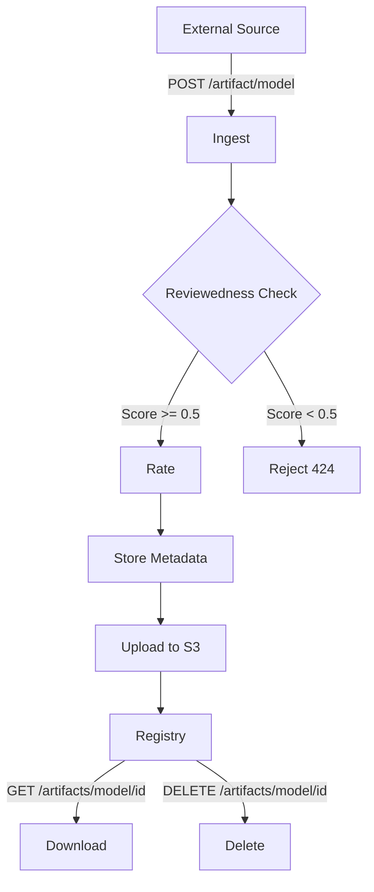
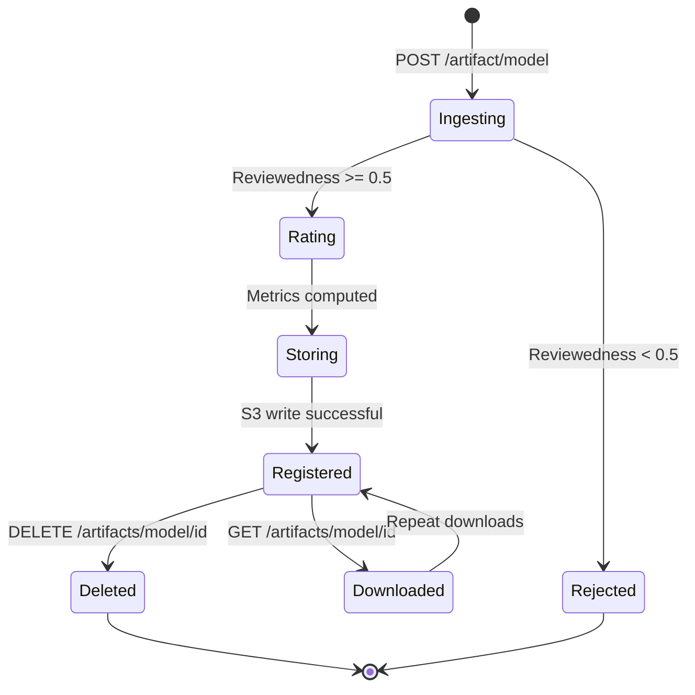

Artifacts in the Trustworthy Model Registry follow a well-defined lifecycle from ingestion to deletion. This page documents each stage and the transitions between them.

## Lifecycle overview



## Stage 1: Ingest

**Entry point**: `POST /artifact/{artifact_type}`

**Source**: `src/api/routers/models.py:931`

### Model ingestion

For model artifacts, the system performs comprehensive ingestion:

```python
# From src/api/routers/models.py:322-396
def _ingest_hf_core(source_url: str) -> Dict[str, Any]:
    # 1. Normalize Hugging Face ID
    hf_id = normalize_hf_id(source_url)
    
    # 2. Fetch license metadata
    hf_license = _fetch_hf_license(hf_id)
    
    # 3. Compute all metrics
    metrics = compute_metrics_for_model(base_resource)
    
    # 4. Extract parent models (lineage)
    parents = extract_parents_from_resource(enriched)
    
    # 5. Create registry entry
    created = _registry.create(mc)
    
    # 6. Generate ZIP artifact
    # 7. Upload to S3
    # 8. Return created artifact
```

<Steps>
  <Step title="URL normalization">
    Convert the input URL to a canonical Hugging Face model ID:
    
    ```python
    # src/utils/hf_normalize.py
    "https://huggingface.co/bert-base-uncased"
    → "bert-base-uncased"
    ```
  </Step>

  <Step title="License extraction">
    Fetch license information from Hugging Face API:
    
    ```python
    # src/api/routers/models.py:296-310
    api_url = f"https://huggingface.co/api/models/{hf_id}"
    resp = requests.get(api_url, timeout=10)
    license = resp.json().get("license", "").lower()
    ```
  </Step>

  <Step title="Metric computation">
    Compute all 13+ metrics via the scoring service:
    
    ```python
    # src/run.py:284-325
    metrics = load_metrics()  # Discover all metric modules
    
    for name, func in metrics.items():
        score, latency = run_with_timeout(func, resource, timeout=90)
        results[name] = (score, latency)
    ```
  </Step>

  <Step title="Lineage extraction">
    Extract parent model references from config.json:
    
    ```python
    # src/metrics/treescore.py:190-256
    cfg = resource.get("config") or {}
    candidate_keys = (
        "base_model",
        "teacher_model",
        "parent_model",
        "source_model",
    )
    parents = [cfg[k] for k in candidate_keys if k in cfg]
    ```
  </Step>
</Steps>

### Dataset and code ingestion

Dataset and code artifacts follow a simplified flow:

```python
# From src/api/routers/models.py:1008-1043
if artifact_type in ("dataset", "code"):
    mc = ModelCreate(
        name=final_name,
        version="1.0.0",
        card="",
        tags=[],
        metadata={},
        source_uri=body.url,
    )
    created = _registry.create(mc)
    created["metadata"]["type"] = artifact_type
```

<Note>
Dataset and code artifacts are **not scored** during ingestion. Only model artifacts undergo metric computation.
</Note>

## Stage 2: Reviewedness gate

**Source**: `src/api/routers/models.py:356-363`

Before ingestion completes, models must pass a quality threshold:

```python
# From src/api/routers/models.py:351-363
reviewedness = float(metrics.get("reviewedness", 0.0) or 0.0)

if reviewedness < 0.5:
    raise HTTPException(
        status_code=424,
        detail=f"Ingest rejected: reviewedness={reviewedness:.2f} < 0.50",
    )
```

### Gate behavior

| Reviewedness score | Result | HTTP status |
|--------------------|--------|-------------|
| >= 0.5 | Ingestion proceeds | 201 Created |
| < 0.5 | Ingestion rejected | 424 Failed Dependency |

<Warning>
The reviewedness gate prevents low-quality or untrusted models from entering the registry. Models below the threshold must improve their download count, likes, or documentation before ingestion succeeds.
</Warning>

## Stage 3: Rating

**Source**: `src/services/scoring.py`

All model metrics are computed by the `ScoringService`:

```python
# From src/services/scoring.py:180-292
def rate(self, resource: Any) -> Dict[str, Any]:
    # 1. Normalize to HF id
    hf_id = normalize_hf_id(raw_name)
    
    # 2. Build resource dict
    base_resource = {
        "name": hf_id,
        "url": f"https://huggingface.co/{hf_id}",
        "github_url": None,
        "local_path": None,
    }
    
    # 3. Compute all metrics
    metrics = compute_metrics_for_model(base_resource)
    
    # 4. Normalize size_score to dict format
    # 5. Return ModelRating-compatible dict
```

### Metric execution

Metrics run with timeouts to prevent hangs:

```python
# From src/run.py:298-306
for name, func in metrics.items():
    try:
        score, latency = run_with_timeout(
            func, resource, timeout=90, label=f"metric:{name}"
        )
        score = float(max(0.0, min(1.0, score)))
    except Exception:
        score, latency = 0.0, 0
    
    results[name] = (score, latency)
```

<Tip>
Metric failures degrade gracefully to `(0.0, 0)` without crashing the entire rating process.
</Tip>

## Stage 4: Storage

### Registry persistence

**Source**: `src/services/registry.py`

The registry stores artifacts in S3 as JSON:

```python
# From src/services/registry.py:90-114
def create(self, m) -> Dict[str, Any]:
    self._load()  # Reload from S3
    self._id_counter += 1
    new_id = str(self._id_counter)
    
    entry = {
        "id": new_id,
        "name": m.name,
        "version": m.version,
        "metadata": dict(m.metadata),
    }
    
    self._models.append(entry)
    self._save()  # Write back to S3
    return entry
```

### Storage location

Artifacts are stored in two S3 objects:

<CodeGroup>
```plaintext Registry metadata
Bucket: {S3_BUCKET}
Key: registry/registry.json

Structure:
{
  "models": [
    {
      "id": "1",
      "name": "bert-base-uncased",
      "version": "1.0.0",
      "metadata": { ... all metrics ... }
    }
  ],
  "id_counter": 1
}
```

```plaintext Artifact ZIP
Bucket: {S3_BUCKET}
Key: artifacts/model/{id}.zip

Contents:
- source_url.txt (Hugging Face URL)
```
</CodeGroup>

### Artifact ZIP generation

```python
# From src/api/routers/models.py:415-439
mem_zip = io.BytesIO()
with zipfile.ZipFile(mem_zip, "w", zipfile.ZIP_DEFLATED) as z:
    z.writestr("source_url.txt", hf_url)

key = f"artifacts/model/{model_id}.zip"
_storage.put_bytes(key, mem_zip.getvalue())
presigned = _storage.presign(key)
```

<Note>
The ZIP artifact is minimal for model ingestion. It only contains the source URL, not the actual model weights.
</Note>

### Local storage fallback

**Source**: `src/services/storage.py:56-66`

For development without AWS:

```python
# From src/services/storage.py:36-66
LOCAL_MODE = os.getenv("LOCAL_STORAGE", "0") == "1"

if LOCAL_MODE:
    path = os.path.join("/tmp/local-artifacts", key)
    os.makedirs(os.path.dirname(path), exist_ok=True)
    with open(path, "wb") as f:
        f.write(data)
else:
    s3.put_object(Bucket=BUCKET, Key=key, Body=data)
```

Set `LOCAL_STORAGE=1` to store artifacts locally at `/tmp/local-artifacts/`.

## Stage 5: Download

**Entry point**: `GET /artifacts/{artifact_type}/{id}`

**Source**: `src/api/routers/models.py:1057`

### Retrieval flow

```python
# From src/api/routers/models.py:1105-1148
item = _registry.get(artifact_id)
if not item:
    raise HTTPException(status_code=404, detail="Artifact does not exist.")

meta = item.get("metadata") or {}
source_uri = item.get("source_uri") or meta.get("source_uri")
download_url = meta.get("download_url")

return Artifact(
    metadata=ArtifactMetadata(
        name=item["name"],
        id=item["id"],
        type=stored_type,
    ),
    data=ArtifactData(
        url=source_uri,
        download_url=download_url
    )
)
```

### Presigned URLs

**Source**: `src/services/storage.py:80-91`

Download URLs are temporary S3 presigned URLs:

```python
# From src/services/storage.py:80-91
def presign(self, key: str, expires: int = 3600) -> str:
    if LOCAL_MODE:
        return f"local://download/{key}"
    
    return s3.generate_presigned_url(
        "get_object",
        Params={"Bucket": BUCKET, "Key": key},
        ExpiresIn=expires,  # 1 hour default
    )
```

<Info>
Presigned URLs expire after 3600 seconds (1 hour) by default.
</Info>

## Stage 6: Delete

**Entry point**: `DELETE /artifacts/{artifact_type}/{id}`

**Source**: `src/api/routers/models.py:1207`

### Deletion flow

```python
# From src/api/routers/models.py:1208-1221
ok = _registry.delete(id)
if not ok:
    raise HTTPException(status_code=404, detail="Artifact does not exist.")
return {"status": "deleted", "id": id}
```

### Registry deletion logic

**Source**: `src/services/registry.py:129-136`

```python
# From src/services/registry.py:129-136
def delete(self, id_: str) -> bool:
    self._load()
    before = len(self._models)
    self._models = [m for m in self._models if str(m.get("id", "")) != id_]
    if len(self._models) < before:
        self._save()
        return True
    return False
```

<Warning>
Deletion removes the artifact from `registry.json` but does **not** delete the ZIP file from S3. The artifact ZIP remains in storage.
</Warning>

## State transitions

### Valid transitions



### Error states

| Error | Stage | HTTP status | Recovery |
|-------|-------|-------------|----------|
| Invalid URL | Ingest | 400 | Fix URL format |
| Low reviewedness | Rating | 424 | Improve model quality |
| S3 write failure | Storing | 500 | Retry ingestion |
| Artifact not found | Download/Delete | 404 | Verify artifact ID |

## Registry format

The `registry.json` file structure:

```json
{
  "models": [
    {
      "id": "1",
      "name": "bert-base-uncased",
      "version": "1.0.0",
      "metadata": {
        "type": "model",
        "net_score": 0.7234,
        "reproducibility": 0.8,
        "reviewedness": 0.89,
        "license": 1.0,
        "code_quality": 0.75,
        "bus_factor": 0.6,
        "ramp_up_time": 0.65,
        "performance_claims": 1.0,
        "dataset_quality": 0.7,
        "dataset_and_code_score": 1.0,
        "treescore": 0.8125,
        "size": {
          "raspberry_pi": 0.5,
          "jetson_nano": 0.75,
          "desktop_pc": 0.92,
          "aws_server": 0.95
        },
        "parents": ["google-bert/bert-base-uncased"],
        "download_url": "https://s3.../artifacts/model/1.zip"
      }
    }
  ],
  "id_counter": 1
}
```

## Best practices

<CardGroup cols={2}>
  <Card title="Always validate inputs" icon="shield-check">
    The ingestion service validates URLs, normalizes IDs, and checks score thresholds before persisting.
  </Card>

  <Card title="Handle failures gracefully" icon="circle-exclamation">
    Metric computation failures default to 0.0 without crashing the entire rating process.
  </Card>

  <Card title="Use presigned URLs" icon="clock">
    Download URLs expire after 1 hour. Generate fresh URLs on each download request.
  </Card>

  <Card title="Monitor S3 writes" icon="database">
    Registry writes to S3 can fail. The system logs errors but doesn't retry automatically.
  </Card>
</CardGroup>
