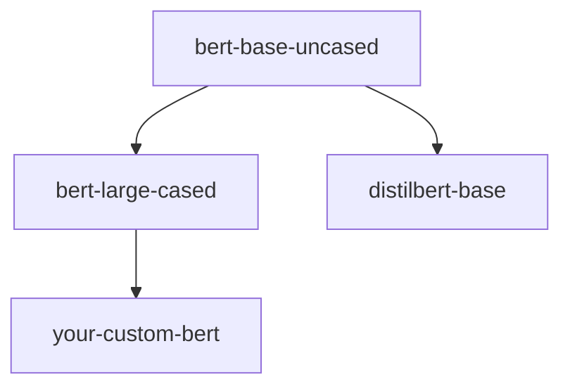
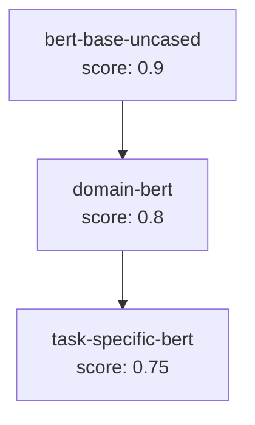

The Trustworthy Model Registry tracks **model lineage**—the parent-child relationships between models—to provide transparency into model provenance and enable dependency analysis.

## What is lineage?

Lineage captures the ancestry of a model by identifying which base models it was fine-tuned from. For example:



In this graph:
- `bert-base-uncased` is the **parent** of `bert-large-cased`
- `your-custom-bert` is a **child** of `bert-large-cased`
- `bert-base-uncased` is a **grandparent** of `your-custom-bert`

## Lineage extraction

**Source**: `src/metrics/treescore.py:190-256`

### Parent model detection

The registry extracts parent models from **config.json** metadata:

```python
# From src/metrics/treescore.py:190-256
def extract_parents_from_resource(resource: Dict[str, Any]) -> List[str]:
    parents: Set[str] = set()
    
    # 1. PRIMARY SOURCE: config.json (structured metadata)
    cfg = resource.get("config") or {}
    candidate_keys = (
        "base_model",
        "teacher_model",
        "parent_model",
        "source_model",
        "original_model",
        "pretrained_model_name_or_path",
    )
    
    for key in candidate_keys:
        val = cfg.get(key)
        if isinstance(val, str) and "/" in val:
            parents.add(normalize_hf_id(val))
    
    # 2. SECONDARY SOURCE: HF metadata tags
    hf_meta = resource.get("hf_metadata") or {}
    tags = hf_meta.get("tags") or []
    for t in tags:
        if "/" in t and not t.startswith(("task:", "pipeline:", "license:")):
            parents.add(normalize_hf_id(t))
    
    return sorted(parents)
```

### Extraction priority

<Steps>
  <Step title="config.json (highest priority)">
    The `config.json` file contains structured metadata set during model training:
    
    ```json
    {
      "base_model": "bert-base-uncased",
      "pretrained_model_name_or_path": "google-bert/bert-base-uncased"
    }
    ```
  </Step>

  <Step title="HF metadata tags (fallback)">
    If config.json doesn't specify parents, check Hugging Face tags:
    
    ```python
    tags = ["bert-base", "pytorch", "fill-mask"]
    # "bert-base" has no "/" → ignored
    # "pytorch" → ignored (not a model ID)
    ```
  </Step>

  <Step title="Self-reference filtering">
    The model itself is excluded from its parent list:
    
    ```python
    # From src/metrics/treescore.py:252-253
    parents.discard(name)  # Don't list model as its own parent
    ```
  </Step>
</Steps>

### Config.json keys checked

The extractor looks for these keys in order:

| Key | Description | Example |
|-----|-------------|----------|
| `base_model` | Base model identifier | `"bert-base-uncased"` |
| `teacher_model` | For distillation | `"bert-large-uncased"` |
| `parent_model` | Explicit parent | `"gpt2"` |
| `source_model` | Source checkpoint | `"roberta-base"` |
| `original_model` | Original pretrained model | `"t5-small"` |
| `pretrained_model_name_or_path` | Transformers standard | `"facebook/bart-large"` |

<Info>
The extractor checks **all keys** and returns all unique parent references found.
</Info>

## Lineage graph construction

**Source**: `src/services/registry.py:150-221`

### Graph structure

Lineage graphs use a node-and-edge format:

```json
{
  "nodes": [
    {
      "artifact_id": "1",
      "name": "your-custom-bert",
      "source": "config_json",
      "metadata": {}
    },
    {
      "artifact_id": "external:bert-base-uncased",
      "name": "bert-base-uncased",
      "source": "config_json",
      "metadata": {"external": true}
    }
  ],
  "edges": [
    {
      "from_node_artifact_id": "external:bert-base-uncased",
      "to_node_artifact_id": "1",
      "relationship": "base_model"
    }
  ]
}
```

### Graph building algorithm

```python
# From src/services/registry.py:150-221
def get_lineage_graph(self, id_: str) -> Dict[str, Any]:
    root = self.get(id_)
    nodes: Dict[str, Dict[str, Any]] = {}
    edges: List[Dict[str, str]] = []
    
    # 1. Always include root node first
    nodes[root["id"]] = {
        "artifact_id": root["id"],
        "name": root["name"],
        "source": "config_json",
        "metadata": {}
    }
    
    # 2. Extract parent from metadata
    meta = root.get("metadata") or {}
    hf_parent = meta.get("base_model_name_or_path")
    
    # 3. Check if parent exists in registry
    if hf_parent:
        parent_model = None
        for m in self._models:
            if m.get("name") == hf_parent:
                parent_model = m
                break
        
        if parent_model:
            # Internal parent (already in registry)
            pid = str(parent_model["id"])
            nodes[pid] = {
                "artifact_id": pid,
                "name": parent_model["name"],
                "source": "config_json",
                "metadata": {}
            }
            edges.append({
                "from_node_artifact_id": pid,
                "to_node_artifact_id": root["id"],
                "relationship": "base_model"
            })
        else:
            # External parent (not in registry)
            external_id = f"external:{hf_parent}"
            nodes[external_id] = {
                "artifact_id": external_id,
                "name": hf_parent,
                "source": "config_json",
                "metadata": {"external": True}
            }
            edges.append({
                "from_node_artifact_id": external_id,
                "to_node_artifact_id": root["id"],
                "relationship": "base_model"
            })
    
    return {"nodes": list(nodes.values()), "edges": edges}
```

### Internal vs external parents

<Tabs>
  <Tab title="Internal parent">
    When the parent model exists in the registry:
    
    ```json
    {
      "artifact_id": "2",
      "name": "bert-base-uncased",
      "source": "config_json",
      "metadata": {}
    }
    ```
    
    Uses the registry's assigned ID.
  </Tab>

  <Tab title="External parent">
    When the parent model is **not** in the registry:
    
    ```json
    {
      "artifact_id": "external:bert-base-uncased",
      "name": "bert-base-uncased",
      "source": "config_json",
      "metadata": {"external": true}
    }
    ```
    
    Uses a synthetic ID with `external:` prefix.
  </Tab>
</Tabs>

<Note>
External parents allow the graph to reference models not yet ingested into the registry.
</Note>

## Tree score calculation

**Source**: `src/metrics/treescore.py`

The **tree score** evaluates a model in the context of its ancestry:

### Calculation algorithm

```python
# From src/metrics/treescore.py:258-283
def metric(resource: Dict[str, Any]) -> Tuple[float, int]:
    repo = normalize_hf_id(resource.get("name"))
    
    # 1. Compute model's own net score
    own = _net(repo)
    
    # 2. Walk lineage tree to get ancestor scores
    ancestor_sum, ancestor_count = _walk(repo, seen=set())
    
    # 3. Combine scores
    if ancestor_count == 0:
        score = own  # No parents, use own score
    else:
        avg_ancestor = ancestor_sum / ancestor_count
        score = (own + avg_ancestor) / 2.0
    
    return float(max(0, min(1, score))), latency
```

### Recursive tree walking

```python
# From src/metrics/treescore.py:169-188
def _walk(repo: str, seen: Set[str]) -> Tuple[float, int]:
    if repo in seen:
        return 0.0, 0  # Cycle detection
    seen.add(repo)
    
    parents = _parents(repo)
    total = 0.0
    count = 0
    
    for p in parents:
        # Score this parent
        pn = _net(p)
        total += pn
        count += 1
        
        # Recursively score parent's ancestors
        ssum, scnt = _walk(p, seen)
        total += ssum
        count += scnt
    
    return total, count
```

### Net score computation

```python
# From src/metrics/treescore.py:101-132
def _net(repo: str) -> float:
    metrics = _load_metrics()  # All other metrics except treescore
    resource = {
        "name": repo,
        "url": f"https://huggingface.co/{repo}",
        "category": "MODEL",
    }
    
    scores = []
    for name, fn in metrics.items():
        try:
            s, _lat = fn(resource)
            sc = _scalar(name, s)
            if sc is not None:
                scores.append(sc)
        except:
            pass
    
    return float(sum(scores)/len(scores)) if scores else 0.0
```

<Info>
The net score is computed from **all metrics except treescore** to avoid circular dependencies.
</Info>

## Lineage API

**Endpoint**: `GET /artifact/model/{id}/lineage`

**Source**: `src/api/routers/models.py:714-731`

### Request

```bash
GET /artifact/model/3/lineage
```

### Response

```json
{
  "nodes": [
    {
      "artifact_id": "3",
      "name": "my-fine-tuned-model",
      "source": "config_json",
      "metadata": {}
    },
    {
      "artifact_id": "2",
      "name": "bert-base-uncased",
      "source": "config_json",
      "metadata": {}
    },
    {
      "artifact_id": "external:roberta-base",
      "name": "roberta-base",
      "source": "config_json",
      "metadata": {"external": true}
    }
  ],
  "edges": [
    {
      "from_node_artifact_id": "2",
      "to_node_artifact_id": "3",
      "relationship": "base_model"
    },
    {
      "from_node_artifact_id": "external:roberta-base",
      "to_node_artifact_id": "2",
      "relationship": "base_model"
    }
  ]
}
```

### Error handling

```python
# From src/api/routers/models.py:718-725
item = _registry.get(id)
if not item:
    raise HTTPException(status_code=404, detail="Artifact does not exist.")

try:
    g = _registry.get_lineage_graph(item["id"])
except KeyError:
    raise HTTPException(status_code=404, detail="Artifact does not exist.")
```

## Lineage examples

### Example 1: Simple fine-tuning

**Scenario**: You fine-tune BERT for sentiment analysis

```json
// your-sentiment-model/config.json
{
  "base_model": "bert-base-uncased",
  "num_labels": 2
}
```

**Extracted lineage**:

```python
parents = ["bert-base-uncased"]
```

**Tree score calculation**:

```python
own_score = 0.75  # Your model's metrics
parent_score = 0.9  # bert-base-uncased metrics
tree_score = (0.75 + 0.9) / 2 = 0.825
```

### Example 2: Distillation

**Scenario**: You distill a large model to a smaller one

```json
// your-distilled-model/config.json
{
  "teacher_model": "bert-large-uncased",
  "student_model": "distilbert-base-uncased"
}
```

**Extracted lineage**:

```python
parents = ["bert-large-uncased", "distilbert-base-uncased"]
```

**Tree score calculation**:

```python
own_score = 0.7
parent1_score = 0.85  # bert-large-uncased
parent2_score = 0.8   # distilbert-base-uncased
avg_ancestor = (0.85 + 0.8) / 2 = 0.825
tree_score = (0.7 + 0.825) / 2 = 0.7625
```

### Example 3: Multi-generation lineage

**Scenario**: Fine-tune a fine-tuned model



**Tree score for task-specific-bert**:

```python
own_score = 0.75
parent_score = 0.8  # domain-bert
grandparent_score = 0.9  # bert-base-uncased

# Walk returns both ancestors
ancestor_sum = 0.8 + 0.9 = 1.7
ancestor_count = 2
avg_ancestor = 1.7 / 2 = 0.85

tree_score = (0.75 + 0.85) / 2 = 0.8
```

<Tip>
Tree score rewards models built on high-quality foundations. A model with mediocre metrics but excellent parents can still achieve a good tree score.
</Tip>

## Cycle detection

**Source**: `src/metrics/treescore.py:169-173`

The tree walker detects and breaks cycles:

```python
# From src/metrics/treescore.py:169-173
def _walk(repo: str, seen: Set[str]) -> Tuple[float, int]:
    if repo in seen:
        return 0.0, 0  # Cycle detected, stop recursion
    seen.add(repo)
    # ... continue walking
```

### Why cycles occur

- Incorrect metadata in config.json
- Models listing themselves as parents
- Circular fine-tuning chains (A → B → A)

<Warning>
Cycles are silently broken to prevent infinite loops. The cycle edge contributes 0.0 to the tree score.
</Warning>

## Limitations

<CardGroup cols={2}>
  <Card title="Shallow graphs" icon="layer-group">
    The current implementation only builds **one level** of lineage (direct parents). Multi-generation graphs require recursive API calls.
  </Card>

  <Card title="Config.json dependency" icon="file-code">
    Lineage extraction requires `config.json` to be present. Models without it show no parents.
  </Card>

  <Card title="No sibling detection" icon="code-branch">
    The graph doesn't identify sibling models (models sharing the same parent).
  </Card>

  <Card title="External parents not scored" icon="cloud-slash">
    External parents (not in registry) don't contribute to tree score calculation.
  </Card>
</CardGroup>

## Best practices

<Steps>
  <Step title="Always set base_model">
    When fine-tuning, set `base_model` in your config.json:
    
    ```python
    from transformers import AutoModelForSequenceClassification
    
    model = AutoModelForSequenceClassification.from_pretrained(
        "bert-base-uncased",
        num_labels=2
    )
    
    # Ensure config includes base model
    model.config.base_model = "bert-base-uncased"
    model.save_pretrained("./my-model")
    ```
  </Step>

  <Step title="Normalize parent IDs">
    Use full Hugging Face IDs:
    
    ✅ `"google-bert/bert-base-uncased"`  
    ❌ `"bert-base"`  
    ❌ `"BERT"`
  </Step>

  <Step title="Ingest parents first">
    For accurate tree scores, ingest parent models before child models:
    
    ```bash
    # 1. Ingest base model
    POST /artifact/model {"url": "https://huggingface.co/bert-base-uncased"}
    
    # 2. Ingest fine-tuned model
    POST /artifact/model {"url": "https://huggingface.co/your-bert-model"}
    ```
  </Step>

  <Step title="Visualize lineage">
    Use the lineage API to visualize model ancestry:
    
    ```javascript
    const response = await fetch('/artifact/model/3/lineage');
    const graph = await response.json();
    renderGraph(graph.nodes, graph.edges);
    ```
  </Step>
</Steps>
